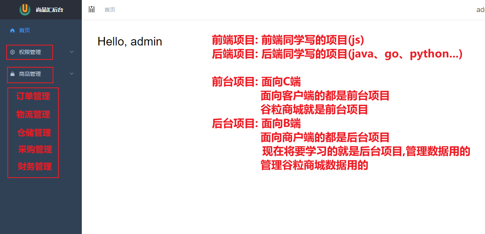
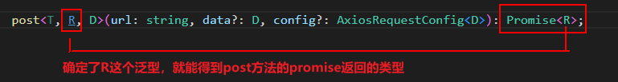
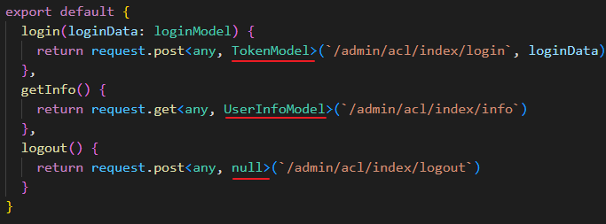
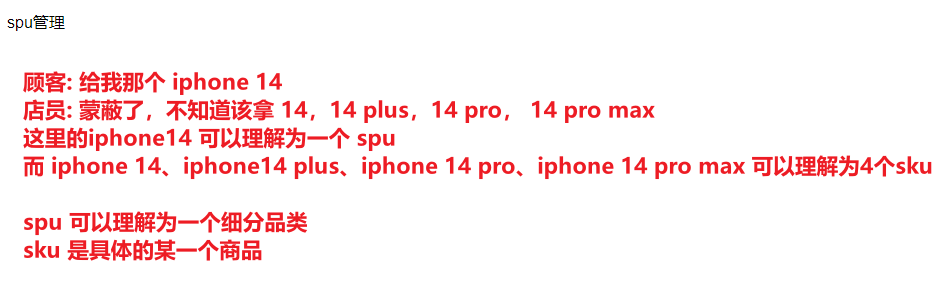
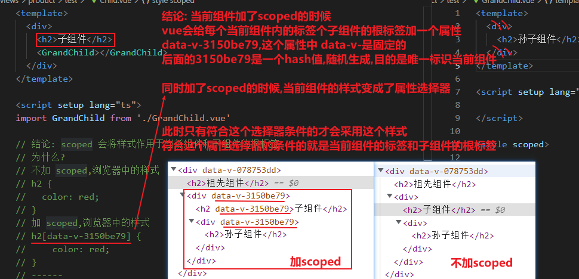

## 说明
* 基于Vue3的电商中台管理项目
* 技术栈: TS + Vue3 + VueRouter4 + Pinia + ElementPlus
* 当前为完成版
* 学习参见 文档 文件夹下的MD文件


# day01


## 项目介绍




## 项目目录介绍

项目是一个 模板 上直接写，这个模板是 潘嘉诚 写的(他写的是vue2版本)，硅谷拿到之后改成了 vue3 版本

项目目录介绍

```
|-node_modules 依赖包
|-public  包含会被自动打包到项目根路径的文件夹
	|-favicon.ico  页面标题图标
	|-static/logo.png 应用Logo图片
|-src
	|-assets  组件中需要使用的公用资源
		|-404_images  404页面的图片
		|-bg.jpg	    登录背景图片
	|-components  公共非路由组件
		|-Breadcrumb 面包屑组件(头部水平方向的层级组件)
		|-Hamburger  用来点击切换左侧菜单导航的图标组件
		|-SvgIcon    svg图标组件
	|-hooks	自定义hook模块
		|-useResize.ts  处理应用在不同屏幕下的适应问题
	|-layout 管理界面整体布局(一级路由)
		|-components  组成整体布局的一些子组件
		|-index.vue  后台管理的整体界面布局组件
	|-router
		|-index.ts  路由器
		|-routes.ts	路由表
	|-stores
		|-interface/index.ts state数据接口
		|-app.js  管理应用相关数据
		|-settings.js  管理设置相关数据
		|-userInfo.js  管理后台登陆用户相关数据
		|-index.js  pinia的store
	|-styles
		|-xxx.scss  项目组件需要使用的一些样式(使用scss)
	|-utils  一些工具函数
		|-get-page-title.js  得到要显示的网页title
		|-token-utils.js  操作登录用户的token cookie
		|-request.js axios 二次封装的模块
		|-validate.js  检验相关工具函数
	|-views  路由组件文件夹
		|-error/404.vue 404页面 
		|-home  首页
		|-login  登陆
	|-App.vue  应用根组件
	|-main.ts  入口js
	|-permission.ts  使用全局守卫实现路由权限控制的模块
	|-settings.ts  包含应用设置信息的模块
|-.env 通用的环境配置
|-.env.development  指定了开发环境的代理服务器前缀路径
|-.env.production  指定了生产环境的代理服务器前缀路径
|-.eslintrc.cjs  eslint的检查配置
|-.gitignore  git的忽略配置
|-env.d.ts  让TS认知Vue的配置
|-index.html 唯一的页面
|-package-lock.json  当前项目依赖的第三方包的精确信息
|-package.json  当前项目包信息
|-README.md	git仓库的md文档
|-shims.d.ts	告诉TS, vue 文件是这种类型
|-tsconfig.config.json  TS的配置文件
|-tsconfig.json	TS的配置文件
|-vite.config.ts  vite相关配置(如: 代理服务器等)
```

### 相对重要的部分

```js
src 
  assets # 包含一些静态资源, 如图片
  components # 包含一些通用的非路由组件
  layout # 管理界面整体布局
  router # 路由相关
  store # pinia相关
		userInfo.ts  # 管理后台登陆用户相关数据
		index.ts  # pinia的store
  styles # 包含一些scss样式模块
  utils # 包含一些工具模块
    token-utils.ts # 存储token的模块
    request.ts # axios二次封装的模块
  views # 包含一些路由组件
    login/index.vue # 用户登陆路由组件
  App.vue # 应用根组件
  main.ts # 入口js
  permission.ts # 使用全局守卫做权限控制的模块
.env.development  # 配置开发环境的变量   代理前缀路径
.env.production # 配置生产环境的变量 代理前缀路径
tsconfig.json # 用于引入模块路径时, 加@后还可以提示
package-lock.json  # 保存了下载的依赖包的准确详细信息
vite.config.ts # vite配置   配置代理等
```


## 项目准备工作

### 项目关联到gitee

1. 在 gitee 上创建仓库

2. 初始化本地仓库

   ```js
   // 初始化本地仓库
   git init
   // 生成一个初始化节点
   git add .
   git commit -m 'init'
   ```

3. 关联远端仓库

   ```js
   // 关联远端仓库
   git remote add origin https://gitee.com/newsegmentfault/gshop-admin_0731.git
   // 将代码推送到远端
   git push -u origin "master"
   ```

4. 将项目设置成开源


### 关于地址

前台项目地址: http://101.43.227.123/#/home

后台项目地址: http://101.43.227.123:6166

vue3base基础gitee地址: https://gitee.com/newsegmentfault/vue3base_0731

后台项目gitee地址: https://gitee.com/newsegmentfault/gshop-admin_0731


### 接口文档

商品管理接口文档: http://39.98.123.211:8510/swagger-ui.html

权限接口文档: http://39.98.123.211:8170/swagger-ui.html

> 了解: swagger是一个java在写api接口的时候可以自动生成的一个接口文档


## 页面结构

我们拿到项目之后从 main.ts 文件，一点一点熟悉

1. 看到 main.ts 引入了 App.vue 文件，这个文件是根组件

2.  App.vue 根组件，发现只有一个 router-view，证明整个页面的渲染是通过路由来渲染的

   那么此时我们应该去看一眼路由长啥样子

3. 当我们输入`localhost:3000`此时访问的是`/`路径，在路由中找到根路径，发现渲染的是`src/layout/index.vue`，那么得到结论: App.vue 根组件中`router-view`渲染的组件就是`src/layout/index.vue`

4. 此时发现这个路由重定向到 `/home`

   ```js
   {
     path: '/',
     component: () => import('@/layout/index.vue'),
     redirect: '/home',
     children: [{
       path: 'home',
       name: 'Home',
       component: () => import('@/views/home/index.vue'),
       meta: { 
         title: '首页', 
         icon: 'ele-HomeFilled', 
       }
     }]
   },
   ```

   而`/home` 是当前路由的一个子路由(二级路由)，二级路由渲染的时候也是通过 `router-view` 渲染的

   此时在一级路由组件中一定有一个 `router-view` 标签，用来渲染二级路由的

   告知:

   一级路由组件 `src/layout/index.vue` 中由三部分组成

   ```html
   <sidebar-item v-for="route in userInfoStore.menuRoutes"></sidebar-item>
   
   import { useUserInfoStore } from '@/stores/userInfo'
   const userInfoStore = useUserInfoStore()
   ```

   **SideBar -- 侧边栏 - 发现侧边栏渲染数据来源是 userInfoStore 中的 menuRoutes 这个数据 - 按下不表**

   **Navbar -- 顶部导航 - 发现"退出登陆"的"陆"错了,应该是"录"**

   **AppMain -- 主体内容 - 点开 AppMain.vue 组件查看，发现有了 `router-view` 证明二级路由都是在 AppMain.vue 这个组件中渲染的**


## 需要修改的地方

1. 登录页滚动条不应该出现

   原因是 body 元素默认有8px像素

   解决: 全局加一个

   ```css
   * {
       margin: 0;
       padding: 0
   }
   ```

   加在哪? 全局的css样式 `'src/styles/index.scss'`

2. 登录页的录写错了，需要修改(原来是"陆")

3. 修改一下登录页的背景

   登录页是整个页面渲染的，通过 App.vue 根组件中的 router-view 标签渲染，此时应该去看一眼`login`的路由

   ```js
   {
     path: '/login',
     name: 'Login',
     component: () => import('@/views/login/index.vue'),
     meta: {
       hidden: true
     }
   },
   ```

   找到 `src/views/login/index.vue` 这个文件修改内容

   修改"登陆"的"陆"为"录"

   修改css中 `.login-container` 的背景图片

4. 首页顶部导航(Navbar)"退出登陆"的"陆"需要修改成"录"

   直接找到 `src/layout/navBar.vue` 文件修改文字即可


# day02

## 登陆流程

1. url中输入 `localhost:3000/login` 一级路由渲染登录页面(**当第一次打开项目的时候也是显示的登陆页面**)

   > 注意:
   >
   > url 发生变化的时候先进行路由匹配，在走路由守卫

2. 当点击登录的时候，发送请求给服务器(服务器校验用户名密码成功之后会返回给前端token)，获取token(只要有token就代表登录成功)

   调用的是 store 中的actions方法，发现actions方法中写的是假的，这里内容需要改成真的

   需要真实的调用接口返回token，需要把 token 存储到 store 中 同时需要把 token 存储到 localStorage 中

   > 注意:
   >
   > 登陆接口写好之后想要调通需要配置vite的服务器代理

   ```js
       server: {
         proxy: {
           '/app-dev': {
             target: 'http://gmall-h5-api.atguigu.cn',
             changeOrigin: true,
             rewrite: (path) => path.replace(/^\/app-dev/, ''),
           },
         }
       }
   ```

3. 当 store 中的 actions 调用完毕之后，返回到之前 logon 组件中 await 的地方，继续往后执行，跳转到根路径

4. 在跳转路由的过程中一定会经过路由守卫(什么情况下会经过路由守卫? 只要路由发生了变化都会经过路由守卫)

5. 路由守卫

   ```js
   路由守卫
   
   获取到token判断有没有token
       有token(代表登陆过了)
           判断是不是去登陆页面
           	是的话重定向到"/"
           	不是的话获取个人用户信息,判断是否存在用户信息
   				如果存在 - 放行
   				如果不存在
                   	发请求获取用户信息
                       请求成功直接放行
                       请求失败清除token和个人信息,重新跳转登录页登陆
       没有token
           判断是否去的是白名单(不需要登陆就可以访问的页面)页面
           	是的话 - 放行
   			不是的话 - 去登陆页面
   ```

   > 注意：
   >
   > 当获取个人信息的时候，是通过请求头携带token获取的(携带token是在请求拦截器中携带的)


## 获取个人信息

请求头携带token

```js
// 请求拦截器
service.interceptors.request.use(
  (config) => {
    
    // 携带token
    const userInfoStore = useUserInfoStore()
    let token = userInfoStore.token;
    if (token) {
      (config.headers as AxiosRequestHeaders).token = token;
    }
    
    return config;
  }
);
```

获取个人信息的时候，先写api，调用api之后拿到个人信息，不做处理直接放到 state 中，此时state 中的数据格式个我们接收到的数据格式不一样，需要修改 state 数据个人，并且需要定义 state 的类型

```js
import type { RouteRecordRaw } from "vue-router";

interface UserInfoModel {
  avatar: string,
  buttons: string[],
  name: string,
  roles: string[],
  routes: string[]
}

interface UserInfoState {
  token: string;
  userInfo: UserInfoModel,
  menuRoutes: RouteRecordRaw[] // 用于生成导航菜单的路由列表
}

// 用于初始化个人信息
const initUserInfo = () => ({
  avatar: '',
  buttons: [],
  name: '',
  roles: [],
  routes: []
})


  state: (): UserInfoState => ({
    token: getToken() as string,
    userInfo: initUserInfo(),
    menuRoutes: []
  }),
  actions: {
  	async getInfo () {
      try {
        let result = await userInfoApi.getInfo();
        console.log(result);
        this.userInfo = result; // 存储个人信息(包括个人的基本信息和权限信息)
        
        // 获取个人用户信息的时候,除了用户的基本信息以外还有权限信息
        // 根据用户的权限信息来展示侧边栏(权限相关的会最后说,这里先写死)
        this.menuRoutes = staticRoutes
      } catch (error) {
        ElMessage.error('获取个人信息失败,请重试')
        return Promise.reject(error)
      }
    },
  }
  
```

获取个人信息成功之后，所有需要拿个人信息的地方都需要修改，项目中目前有三个地方使用了个人信息，这三个地方都需要修改

1. 路由守卫中，获取当前用户名位置需要修改(permission.ts文件)

   ```js
   const hasLogin = !!userInfoStore.userInfo.name;
   ```

2. 首页 hello 后面跟的用户名需要修改(home组件)

   ```html
   <div class="home">
     Hello, {{userInfoStore.userInfo.name}}
   </div>
   ```

3. 顶部导航展示个人信息头像和名称位置需要修改(NavBar组件中)

   ```html
   <div class="right-menu-item">{{userInfoStore.userInfo.name}}</div>
   .........
       
   ```

两个问题:

1. 我们取token的时候为什么不直接从 localStorage 中取值,而要从store中的state取值?

   因为从 store 中取值快，store 是内存级，localStorage 是硬盘级别的

2. 刚刚获取到个人信息的时候为什么一直发请求?(班长问的,很好)

   在路由守卫中获取个人信息一直从store中拿不到 `userInfoStore.name` 造成的，存个人信息存在 `userInfoStore.userInfo.name` ，所以每次都会重新发送请求拿数据


## 退出登陆

需要在 Navbar 中点击退出登陆调用 store中的 actions 来进行退出登陆

```js
actions: {
  async reset () {
    try {
      await userInfoApi.logout()
      // 删除local中保存的token
      removeToken()
      // 提交重置用户信息的mutation
      this.token = ''
      this.userInfo = initUserInfo();
    } catch (error) {
      ElMessage.error('退出登陆失败,请重试')
      return Promise.reject(error);
    }
  },
}
```


## 关于请求TS类型

第一次看请求加类型的时候，比较蒙，后面就是固定套路





以后在写 api 接口的时候，直接就把类型写上，固定套路

去接口文档 或者是 已完成的线上项目看接口的返回参数来书写post方法返回的类型


## 侧边栏展示

侧边栏是 SideBar 组件，发现

```html
<sidebar-item v-for="route in userInfoStore.menuRoutes" :key="route.path" :item="route" :base-path="route.path" />
```

数据来源是 userInfoStore.menuRoutes，而这个值在哪里赋值的?

这个数据是在获取个人信息的actions中进行赋值的

```js
async getInfo () {
      try {
        let result = await userInfoApi.getInfo();
        this.userInfo = result; // 存储个人信息(包括个人的基本信息和权限信息)
        
        // 获取个人用户信息的时候,除了用户的基本信息以外还有权限信息
        // 根据用户的权限信息来展示侧边栏(权限相关的会最后说,这里先写死)
        this.menuRoutes = staticRoutes
      }
}
```

这里注意，目前使用的是 staticRoutes , 是一个我们前端写死的数据(路由)，后续会在讲解权限的时候，进行动态处理(为什么要动态处理? 因为每一个用户可以看到的侧边栏不一样)

想要侧边栏渲染出 "商品管理"，需要我们去修改 staticRoutes  这个数据(路由)

```js
{
  path: '/product',
  name: "Product", // 所有的name属性,这个值必须和我写的一样,为什么?按下不表,后续再说
  component: () => import('@/layout/index.vue'),
  meta: { 
    title: '商品管理', 
    icon: 'ele-GoodsFilled', 
  },
  children: [
    {
      path: 'trademark',
      name: 'Trademark',
      component: () => import('@/views/product/trademark/index.vue'),
      meta: { 
        title: '品牌管理' 
      }
    },
    {
      path: 'attr',
      name: 'Attr',
      component: () => import('@/views/product/attr/index.vue'),
      meta: { 
        title: '平台属性管理' 
      }
    },
    {
      path: 'spu',
      name: 'Spu',
      component: () => import('@/views/product/spu/index.vue'),
      meta: { 
        title: 'SPU管理' 
      }
    },
    {
      path: 'sku',
      name: 'Sku',
      component: () => import('@/views/product/sku/index.vue'),
      meta: { 
        title: 'SKU管理' 
      }
    }
  ]
},
```

通过查看 SideBar-Item 组件发现这是一个递归组件，当一级路由有且仅有一个子集路由的时候，会直接渲染这个子集路由作为菜单，当一级路由有多个子集路由的时候，通过递归组件进行渲染二级路由


## 品牌管理

正常在公司中写页面的时候，会有设计图或原型图给到开发者，让开发者遵循设计图或原型图去开发页面，我们这里没有这些东西，照着已完成项目去写即可

写页面的步骤:

1. 静态页面搭建

2. 初始化数据展示

   发请求，调接口，拿数据

   * 书写api，书写api的同时把TS类型写完
   * 在页面初始化的时候调用api，拿到数据，进行展示

# day03

1. 交互

   * 翻页

   * 添加

     点击添加的时候，弹出一个弹框，弹框中有表单内容，表单需要收集 "品牌名称" 和 "品牌LOGO" 这两个字段，当点击保存的时候，调用接口发送请求，将数据传给后端，保存成功之后，弹框消失，并且刷新页面数据

     1. 点击添加按钮弹出弹框

     2. 弹框中静态的搭建(form表单的搭建)

        以上为弹框的静态搭建

     3. 收集表单数据,使用v-model收集表单数据

     4. 当点击保存的时候,调用接口

        先准备api(同时写好TS类型)

        然后在点击"保存"按钮的时候，调用api发送数据

     5. 调用接口成功之后,弹框消失,重新获取页面数据

     6. 点击的是"取消",需要清空表单数据,弹框消失

   * 修改

     点击"编辑"按钮，弹出弹框，回显数据，当再次点击保存的时候，将修改后的数据进行保存，调用更新接口

     1. 弹出弹框，回显数据
     2. 再次点击保存

   * 删除

     所有删除只要涉及到发请求，都需要做"双重校验"，要提示用户当前的数据会被删除


## 表单校验

el-form 表单校验需要三个条件:

1. el-form 绑定 :model="tmForm" 属性，把数据交给 el-form 组件

2. el-form 绑定 :rules="rules" 属性，定义校验的规则

   ```js
   const rules = reactive<FormRules>({
     tmName: [
       // required 必填   message 提示消息   trigger 触发方式(还支持 change)
       { required: true, message: '请输入品牌名称', trigger: 'blur' },
       { min: 2, max: 10, message: '品牌名长度应为2到10个字符', trigger: 'blur' },
     ],
     logoUrl: [
       { required: true, message: '请上传图片', trigger: 'blur' },
     ]
   })
   ```

3. el-form-item 绑定 prop="tmName" 属性，告诉 el-form-item 组件要校验的是哪一个字段

当我们点击保存的时候，需要手动触发一次校验规则，当符合校验规则的时候才能调用保存接口

手动触发校验的时候，需要获取到 el-form 的表单实例才能调用校验方法 validate()

```js
<el-form :model="tmForm" :rules="rules" ref="ruleFormRef"></el-form>

const ruleFormRef = ref<FormInstance>(); // el-form实例

const onSave = async (formEl: FormInstance | undefined) => {
  if (!formEl) return
  // 获取到form表单的实例,调用validate()方法 手动对表单进行一次校验,校验通过回调中的 valid 参数为true
  await formEl.validate(async (valid, fields) => {
    if (valid) {
      
      // 之前保存的代码
      try {
        await tradermarkApi.save(tmForm.value)
        ElMessage.success('保存成功') // 用户提示
        getPage(); // 刷新页面
        cancelSave(formEl);
      } catch (error) {
        ElMessage.error('保存失败')
      }

    } else {
      console.log('保存失败', fields)
    }
  }) 
}
```

重置校验飘红

```js
// formEl 是el-form组件实例
formEl.resetFields()
```

### 自定义校验规则

给 rules 规则中配置字段 `validator` 即可

```js
// 自定义校验的回调
const checkTmName = (rule: any, value: any, callback: any) => {
  if (value === '') {
    callback(new Error('品牌名不能为空'))
  } else {
    if (tmForm.value.tmName.length >= 2 && tmForm.value.tmName.length <= 10) {
      callback()
    } else {
      callback(new Error('品牌名称的长度应为2到10个字符!!'))
    }
  }
}


// 表单校验
const rules = reactive<FormRules>({
  // 自定义校验规则
  tmName: [
    { validator: checkTmName, trigger: 'blur' },
  ],
})
```


## 平台属性管理

一、静态页面搭建

搭建静态的时候，发现三级分类是一个公用的内容，可以封装成一个公用的组件来使用，由于咱们项目中没有其他地方能用到 pinia 了，所以写这个组件的时候使用 pinia 来管理数据

先把三级分类组件搞定，再来搭建页面的静态

二、初始化数据展示

三、交互

* 新增
* 修改
* 删除


### 三级分类组件

组件初始化的时候默认获取到一级分类下拉的数据

当选择到一级分类的数据时，将这个数据存储起来，同时需要请求二级分类下拉数据

当选择到二级分类的数据时，将这个数据存储起来，同时需要请求三级分类下拉数据

当选择到三级分类的数据时，应该初始化主列表显示


### 静态页面搭建

搭建 attr 主界面的时候需要注意，界面有两个状态显示，列表展示状态 和 新增编辑状态，需要一个布尔值来控制这两个状态的切换

```html
<!-- 列表展示 -->
<div class="list" v-if="!isEdit">
  <el-button class="mb-10" type="primary" :icon="Plus" @click="isEdit = true">添加属性</el-button>
  主列表状态
</div>
<!-- 新增编辑 -->
<div class="edit" v-else>
  <div>编辑状态</div>
  <el-button @click="isEdit = false">取消</el-button>
</div>

const isEdit = ref(false); // 默认不是编辑状态,是列表展示状态
```

### 初始化数据展示

1. 准备api(同时把TS类型写上)

   ```ts
   export interface AttrValueModel {
     id?: number,
     valueName: string,
     attrId?: number
   }
   
   export interface AttrModel {
     id?: number, // 新增数据没有id,只有在编辑的情况下才有id
     attrName: string,
     categoryId: number | undefined,
     categoryLevel: number,
     attrValueList: AttrValueModel[]
   }
   
   export default {
     getAttrInfoList(category1Id: number, category2Id: number, category3Id: number) {
       return request.get<any, AttrModel[]>(`/admin/product/attrInfoList/${category1Id}/${category2Id}/${category3Id}`)
     },
   }
   ```

2. 调用 - 当第三级的数据被选择了之后，展示页面的数据

   ```js
   watch(() => categoryStore.category3Id, (nval) => {
     if (nval) {
       // 请求数据
       getList();
     } else {
       // 清空数据
       attrList.value = []
     }
   })
   ```


### 交互

#### 新增

当点击新增按钮的时候，切换到新增边界的界面，需要静态的搭建

静态搭建完毕之后，创建收集表单数据，对编辑界面的数据进行收集，当收集完毕之后调用准备好的api接口

```js
// api
saveAttrInfo(data: AttrModel) {
    return request.post<any, null>(`/admin/product/saveAttrInfo`, data)
}
```

保存按钮点击调用保存接口

```js
// 保存
const onSave = async () => {
  // 组装数据
  attrForm.value.categoryId = categoryStore.category3Id;
  // 发送请求
  try {
    await attrApi.saveAttrInfo(attrForm.value)
    ElMessage.success('保存成功') // 提示
    isEdit.value = false; // 切换回列表显示状态
    attrForm.value = initAttrForm(); // 初始化收集数据的对象
    getList(); // 重新发送请求拿数据
  } catch (error) {
    ElMessage.error('保存失败,请重试')
  }
}

// 取消保存
const cancelSave = () => {
  attrForm.value = initAttrForm(); // 初始化收集数据的变量
  isEdit.value = false; // 切换主列表显示
}
```


#### 增加限制条件

1. "添加属性"按钮限制条件

   在三级分类的第三级选择了之后，才能点击

   ```html
   <el-button class="mb-10" type="primary" :icon="Plus" :disabled="!categoryStore.category3Id" @click="isEdit = true">添加属性</el-button>
   ```

2. 在编辑状态下"三级分类"组件是禁用状态

   ```html
   <CategorySelector :disabled="isEdit"></CategorySelector>
   ```

3. 编辑状态下"添加属性值"按钮，必须在有"属性名"的情况下才能点击

   ```html
   <el-button type="primary" @click="addAttrValue" :disabled="!attrForm.attrName">添加属性值</el-button>
   ```

4. 新增"保存"按钮，只有在 "属性名" 和 "属性值列表" 都有值得情况下才能点击

   ```html
   <el-button type="primary" @click="onSave" :disabled="!(attrForm.attrName && attrForm.attrValueList.length)">保存</el-button>
   ```


# day04

#### 修改

1. 回显数据(注意回显的数据深拷贝)
2. 准备api(已经存在)，调用接口

#### 删除

点击删除按钮需要调用接口，删除只要调接口就需要"双重校验"


#### 编辑状态的input切换

点击"添加属性值"的时候，表格添加了一条新的数据，这个数据应该是一个空串

同时"属性值名称"这一列展示的是一个input框，让用户输入内容修改这个空串的值(切换input)

同时展示的input框应该聚焦(自动聚焦)

---

当输入完内容的时候，点击页面其他位置，input框失焦，然后切换input框的显示(切换input)

---

当再次点击"属性值名称"列中的单元格，input框显示，input聚焦(切换input、自动聚焦)

---

结论：

input 框的切换 和 聚焦是两件事，不要混为一谈

1. input 框的切换

   给 attrValueList 属性值列表的每一个数据添加一个 'inputVisible' 布尔值来控制div和input框的切换

2. 自动聚焦

   * 当点击按钮添加数据的时候需要自动聚焦
   * 当点击div切换input的时候需要自动聚焦

   只要展示input框就需要自动聚焦

   方法：获取到input框组件实例，调用 focus 方法进行聚焦

   ```js
   nextTick(() => {
       inputRef.value?.focus()
   })
   ```

   `nextTick()` 可以在状态改变后立即使用，以等待 DOM 更新完成。你可以传递一个回调函数作为参数，或者 await 返回的 Promise。

3. 对输入input框内容进行了校验

   当失焦的时候，输入的内容不能为空，且不能重复

   ```js
   const inputBlur = (row: AttrValueModel, index: number) => {
     // 需要判断input输入的有没有内容,如果没有内容,该数据不应该存在
     if (!row.valueName) {
       attrForm.value.attrValueList.splice(index, 1)
       ElMessage.error('输入内容不能空')
       return
     }
     // 去重
     // attrForm.value.attrValueList  中 查找 有没有和当前 row.valueName 相同的
     // isRepeat 是否有重复(需要把自己排除掉)
     const isRepeat = attrForm.value.attrValueList.some((item, idx) => {
       if (index === idx) { // 代表是自己,把自己排除掉
         return false
       }
       return item.valueName === row.valueName
     })
     if (isRepeat) { // 代表有重复
       attrForm.value.attrValueList.splice(index, 1)
       ElMessage.error('输入内容重复,请重新输入')
       return
     }
     row.inputVisible = false
   }
   ```

4. 关于 ?

   ```js
   inputRef.value?.focus() -----  inputRef.value 有值就继续之后问号之后的.语法,没有值直接返回这个空值
   
   等价的
   
   inputRef.value && inputRef.value.focus()
   ```

   

#### 拓展 - vue2和vue3设置响应式数据的区别 - $set

vue2 的 API 中 $set 

```js
export default {
    data() {
        return {
            name: '张三'
        }
    }
}
// 这里的 name 是响应式数据
this.name = "李四" // 页面会自动更新
this.age = 18 // 期望有一个age的响应式数据，但是这样写并不能把age属性变成响应式的
this.$set(this, 'age', 18) // 这样添加age属性才能变成响应式的
// 底层实现 Object.defineProperty(this, 'age', { get() {}, set(){} })
```

vue3 中移除了 $set (不需要了)，为什么？

目标：为了将数据变成一个相应的

实现：

* 在vue2中，响应式数据的实现是使用 Object.defineProperty() 这个方法实现的，这个方法是针对某一个对象下的某个属性的，如果在初始化数据的时候，没有这个数据，使用 $set 底层调用  Object.defineProperty() 给当前实例(数据)添加响应式
* 在vue3中，响应式数据的底层实现是 proxy，当创建出一个数据的时候 `new Proxy(obj, { set(){}, get() {} }) `, 参数二是配置对象的拦截器的，这里真对的是这个对象，当给这个对象添加属性的时候，例如 `obj.inputVisible = true`  是会经过 set 方法的，所以不需要单独对 inputVisible 进行处理了


## SPU 管理

SPU 和 SKU 介绍




### 结构搭建

发现页面显示是三个界面，通过三个组件切换进行显示 SpuList、SpuForm、SkuForm

第一版:

```html
<template>
  <div class="spu">
    <el-card class="mb-10">
      <CategorySelector :disabled="showStatus != 1"></CategorySelector>
    </el-card>
    <el-card>
      <SpuList v-if="showStatus == 1" @updateShowStatus="updateShowStatus"></SpuList>
      <SpuForm v-if="showStatus == 2" @updateShowStatus="updateShowStatus"></SpuForm>
      <SkuForm v-if="showStatus == 3" @updateShowStatus="updateShowStatus"></SkuForm>
    </el-card>
  </div>
</template>

<script setup lang="ts">
import SpuList from './components/spuList/index.vue' // 主列表
import SpuForm from './components/spuForm/index.vue' // 新增SPU
import SkuForm from './components/skuForm/index.vue' // 新增SKU
import { ref } from 'vue';

const showStatus = ref(1) // 默认展示主列表

const updateShowStatus = (n: number) => {
  showStatus.value = n;
}
</script>
```

第二版:

改两个地方：

1. 就是咱们的状态值是 1, 2, 3 这样写不好，别人不知道什么意思，换成枚举，以后只要改枚举的值，后续所有引用的地方的值都会发生变化

2.  `@updateShowStatus="updateShowStatus" `可以切换成 v-model 指令使用

   ```html
   <SpuList v-if="showStatus == STATUS.SPULIST" v-model="showStatus"></SpuList>
   <SpuForm v-if="showStatus == STATUS.SPUFORM" v-model="showStatus"></SpuForm>
   <SkuForm v-if="showStatus == STATUS.SKUFORM" v-model="showStatus"></SkuForm>
   ```

   组件内

   ```js
   const emits = defineEmits<{
     (e: 'update:modelValue', n: number): void
   }>()
   const cancelSave = () => {
     emits('update:modelValue', STATUS.SPULIST)
   }
   ```

   


### SPU主列表

1. 界面静态搭建
2. 初始化数据展示
   * 准备api(同时写TS的类型)
   * 监听三级分类id,如果有值调用api拿数据,将数据在页面上展示即可
3. 主列表交互
   * 新增SPU
   * 编辑SPU
   * 删除SPU
   * 新增SKU
   * 查看SKU列表


### 新增SPU

1. 静态页面搭建

   注意：静态搭建的时候，图片上传使用的是 "照片墙"，把所有相关的代码粘贴过来保证不报错即可

2. 初始化数据展示

   初始化数据展示需要展示"品牌下拉"和"销售属性"的下拉数据

   * 准备api(同时写TS)
   * 在页面初始化的时候调用api，拿数据进行展示即可

3. 交互

   收集数据，点击保存，调用api


# day05

### Spu新增交互

收集数据，点击保存，调用api

#### 准备API函数

看下数据来源，得到的结论：销售属性是一条数据，每一条销售属性中有销售属性值列表

```js
saveSpuInfo(spuInfo: SpuModel) {
    return request.post<any, null>(`/admin/product/saveSpuInfo`, spuInfo)
}
```

看一下真实传递给后端的参数，去修改 SpuModel 类型中的 spuSaleAttrList 和 spuImageList 数据的格式，弄懂了每一条数据的来源

#### 新增spu-普通数据收集

spu名称、品牌、描述都是使用 v-model 直接收集即可

```js
const handlerSuccess: UploadProps['onSuccess'] = (response: any, uploadFile: UploadFile, uploadFiles: UploadFiles) => {
  console.log(response, uploadFile, uploadFiles)
  // response 是接口响应的内容
  // uploadFile 是单个文件信息,包括文件名、文件大小等,需要注意的属性有
  //              name 文件名
  //              url 图片路径(目前是本地url)
  //              response 是接口响应的内容
  //              注意: 图片列表数据中单个图片必须要有 name 和 url 两个属性,如果没有,无法预览(这个条件是element规定的)
  // uploadFiles 文件列表,是一个数据,包含多个单个文件
  // 当赋值等号两侧数据的类型不一样的时候,可以使用any进行一下中转
  spuImageList.value = uploadFiles as any;
}

const handleRemove: UploadProps['onRemove'] = (uploadFile, uploadFiles) => {
  spuImageList.value = uploadFiles as any;
}
```

> 注意：
>
> 1. 当赋值等号两侧数据的类型不一样的时候,可以使用any进行一下中转
> 2. 收集到数据最终在保存之前进行数据组装


##### TS中的感叹号

```ts
dialogImageUrl.value = uploadFile.url!
```

```ts
let a: number;
let b: number | undefined; // 忽略这里的undefined
a = b as number;
a = b!;

let c: string = '我爱你';
a = c!; // 这样不行
```

TS中的感叹号是用来忽略类型用的，忽略联合类型中有 undefined 的时候，并且联合类型中有和单独类型重复的类型


#### 销售属性收集

* 销售属性下拉框选中不了，需要一个单独的数据进行收集(单独收集的时候需要同时收集到 id 和 name)

  ```js
  const attrIdAttrName = ref('')
  
  <el-select v-model="attrIdAttrName" placeholder="还有3个未选择" class="mr-10">
    <el-option
      ...
      :value="`${saleAttr.id}:${saleAttr.name}`"
    ></el-option>
  </el-select>
  ```


##### 销售属性的添加和删除

* 点击"添加销售属性"按钮
  * 销售属性表格多了一条数据(多的这条数据来源于下拉框,收集的是 下拉的id和name)
  * 下拉框少了一条数据(使用计算属性去做,只要表格中存在这条数据,下拉框中就不应该存在 - 这个可以往后放)
* "销售属性表格"点击删除数据
  * 表格减少当前点击的数据
  * 下拉框多一个数据(计算属性,只要表格中存在这条数据,下拉框中就不应该存在 - 这个可以往后放)

```js
// 添加销售属性
const addSaleAttr = () => {
  const [baseSaleAttrId, saleAttrName] = attrIdAttrName.value.split(':');

  // 表格展示的数据是 spuForm.spuSaleAttrList
  spuForm.value.spuSaleAttrList.push({
    baseSaleAttrId: Number(baseSaleAttrId),
    saleAttrName,
    spuSaleAttrValueList: []
  })

  // 清空收集的销售属性
  attrIdAttrName.value = ""
}
// 删除销售属性
const deleteSpuSaleAttr = (index: number) => {
  spuForm.value.spuSaleAttrList.splice(index, 1)
}


const saleAttrList = computed(() => { // 真正展示的数据,通过计算属性得出
  
  let arr = baseSaleAttrList.value.filter(row => { // row是原始数据中的每个成员 row -> { id: xx, name: xx }

    // 过滤条件: 表格中有当前这个row的name时,应该过滤掉,没有的话应该留下来
    // 去表格中的数据找有没有row这个name
    // spuForm.value.spuSaleAttrList - 表格数据
    // some方法是只要有一个符合回调条件,返回true
    // isExist 为true代表表格存在当前销售属性原始数据 row
    const isExist = spuForm.value.spuSaleAttrList.some(item => { // item是表格中的每个成员 -> { baseSaleAttrId, saleAttrName, spuSaleAttrValueList }
      return item.saleAttrName == row.name
    })

    // const isExist1 = spuForm.value.spuSaleAttrList.map(item => item.saleAttrName).includes(row.name)

    return !isExist
  })
  
  return arr;
})
```


##### 销售属性值列表的添加和删除

* 点击"销售属性值列表"中的"新增"按钮

  * 切换input框显示

    在"销售属性"这条数据row,当中添加一个 inputVisible 来控制 input 和 div 的显示和隐藏

  * 自动聚焦(input展示的时候自动聚焦，在nextTick中，通过实例调用 focus() 方法聚焦)

  ```js
  <el-button v-else size="small" @click="showInput(row)">
  	新增
  </el-button>
  
  const InputRef = ref<HTMLInputElement>(); // 自动聚焦
  const showInput = (row: SpuSaleAttrModel) => { // row是当前的销售属性
    row.inputVisible = true
    nextTick(() => {
      InputRef.value?.focus()
    })
  }
  ```

* 当失焦的时候

  * 空不能被添加上,重复不能添加,重复的给提示
  * 切换input显示按钮
  * 将input输入的内容，加到属性值列表

  ```js
  <el-input
    v-if="row.inputVisible"
    ref="InputRef"
    v-model="row.inputValue"
    size="small"
    style="width: 100px"
    @blur="handleInputConfirm(row)"
  />
        
  const handleInputConfirm = (row: SpuSaleAttrModel) => { // row是当前的销售属性
    // 对空值进行判断,没有值直接切换回来即可
    if (!row.inputValue) {
      row.inputVisible = false
      return
    }
    // 重复
  
    let isRepate = row.spuSaleAttrValueList.map(item => item.saleAttrValueName).includes(row.inputValue)
    if (isRepate) {
      row.inputVisible = false
      row.inputValue = "" // 数据已经被收集起来了,这里应该清空
      ElMessage.error('输入的内容不能重复,请重新输入')
      return
    }
    row.inputVisible = false // 切换显示div
  
    // row.spuSaleAttrValueList 销售属性值列表
    row.spuSaleAttrValueList.push({
      baseSaleAttrId: row.baseSaleAttrId,
      saleAttrValueName: row.inputValue!
    })
  
    row.inputValue = "" // 数据已经被收集起来了,这里应该清空
  }
  ```

* "属性值列表"数据应该循环展示，当点击 tag 标签上的 "x" 按钮的时候，删除掉当前的属性值

  ```js
  <el-tag
    class="mr-5"
    v-for="(attrVal, index) in row.spuSaleAttrValueList"
    :key="index"
    closable
    @close="handleClose(index, row.spuSaleAttrValueList)"
  >
    {{ attrVal.saleAttrValueName }}
  </el-tag>
  
  // 删除销售属性值
  const handleClose = (index: number, spuSaleAttrValueList: SpuSaleAttrValueModel[]) => {
    spuSaleAttrValueList.splice(index, 1)
  }
  ```

  

#### 新增保存销售属性

```js
const onSave = async () => {
  // 组装数据
  // 三级分类的收集
  spuForm.value.category3Id = categoryStore.category3Id;
  // 图片列表数据收集
  let tempSpuImageList = spuImageList.value.map(item => {
    return {
      imgName: item.name,
      imgUrl: item.response.data
    }
  })
  spuForm.value.spuImageList = tempSpuImageList as SpuImageModel[];
  // 删除掉 销售属性 row 中的inputVisible 和 inputValue(后端不需要这两个数据,传给后端也没事)
  spuForm.value.spuSaleAttrList.forEach(item => {
    delete item.inputValue
    delete item.inputVisible
  })
  // 简单校验(每个项都有值就通过,没有值给个提示即可)
  const { spuName, description, tmId, category3Id, spuSaleAttrList } = spuForm.value;
  if (   !(spuName && description && tmId && category3Id && spuForm.value.spuImageList.length && spuSaleAttrList.length)   ) {
    ElMessage.error('请检查SPU名称、品牌、描述、三级分类、图片列表和销售属性数据')
    return
  }

  // 发送请求
  try {
    await spuApi.saveSpuInfo(spuForm.value)
    ElMessage.success('保存成功')
    emits('update:modelValue', STATUS.SPULIST)
  } catch (error) {
    ElMessage.error('保存失败,请重试')
  }
}
```

> 目前取消再次点击添加的时候，表单为空，不需要单独的做处理

##### 新增Spu按钮限制

只有三级分类id存在的时候才能点击"新增spu"按钮，这个功能在主列表中

```html
<el-button class="mb-10" type="primary" :icon="Plus" :disabled="!categoryStore.category3Id" @click="addSpu">添加SPU</el-button>
```


### 编辑

当点击编辑按钮的时候，此时要回显当前这一条 spu 的数据，但是分页数据拿的时候没有 图片列表 和 销售属性的数据，需要在页面初始化的时候发请求拿这两个数据

1. 回显数据

   把当前的这条数据(存在于SpuList组件)赋值给 SpuForm 组件中的 spuForm 数据

   SpuList 组件 和 SpuForm 组件是兄弟关系，把当前的 row先传给父组件，在通过父组件传给 SpuForm 组件

   SpuList组件

   ```js
   const emits = defineEmits<{
     (e: 'update:modelValue', n: number): void
     (e: 'changeSpuInfo', spu: SpuModel): void  // ----
   }>()
   // 编辑spu
   const editSpu = (row: SpuModel) => {
     emits('changeSpuInfo', row)
   }
   ```

   父组件

   ```js
   <SpuList v-if="showStatus == STATUS.SPULIST" v-model="showStatus" @changeSpuInfo="changeSpuInfo"></SpuList>
   <SpuForm v-if="showStatus == STATUS.SPUFORM" v-model="showStatus" :spuInfo="spuInfo"></SpuForm>
   
   
   // initSpuInfo 仅仅使用回来初始化一个spu用的
   const initSpuInfo = ():SpuModel  => ({
     spuName: '',
     description: '',
     category3Id: undefined, // 三级分类的id两个位置赋值,要么初始化赋值,保存前组装数据赋值
     tmId: undefined,
     spuSaleAttrList: [],
     spuImageList: []
   })
   const spuInfo = ref<SpuModel>(initSpuInfo()) // 传给子组件
   const changeSpuInfo = (spu: SpuModel) => {
     spuInfo.value = spu; // 接收到主列表传过来的spu,在传给SpuForm即可
   }
   ```

   SpuForm 组件

   ```js
   const props = defineProps<{ // 编辑的时候接收父组件传过来的spu数据
     spuInfo: SpuModel
   }>()
   ```

2. 初始化数据 拿  图片列表 和 销售属性的数据

   > 在写代码的过程中又去修改了TS的类型，如果以后想把TS类型一次性写好，先看编辑的数据，因为编辑的数据永远比新增的数据多而全

   准备根据 spuId 获取图片列表接口 和 销售属性接口

   ```js
   // 根据spuId获取spu图片列表
   getSpuImageListBySpuId(spuId: number) {
     return request.get<any, SpuImageModel[]>(`/admin/product/spuImageList/${ spuId }`)
   },
   // 根据spuId获取spu销售属性
   getSaleAttrListBySpuId(spuId: number) {
     return request.get<any, SpuSaleAttrModel[]>(`/admin/product/spuSaleAttrList/${ spuId }`)
   }
   ```

   > 注意：需要再次修改TS类型

   页面mounted的时候发起请求拿 图片和销售属性数据

   ```js
   // 拿编辑spu的图片列表数据
   const initSpuImageData = async () => {
     try {
       let result = await spuApi.getSpuImageListBySpuId(spuForm.value.id!)
       spuImageList.value = result.map(item => {
         return {
           ...item,
           name: item.imgName, // name和url属性是组件预览必要的属性,否则预览不出来
           url: item.imgUrl
         }
       });
     } catch (error) {
       ElMessage.error('获取图片列表数据失败,请重试')
     }
   }
   // 拿编辑spu销售属性数据
   const initSaleAttrData = async () => {
     try {
       let result = await spuApi.getSaleAttrListBySpuId(spuForm.value.id!)
       spuForm.value.spuSaleAttrList = result;
     } catch (error) {
       ElMessage.error('获取销售属性数据失败,请重试')
     }
   }
   
   // 初始化数据展示
   onMounted(() => {
     initTrademarkDate(); // 初始化品牌下拉
     initBaseSaleAttrDate(); // 初始化销售属性下拉下拉
     if (props.spuInfo.id) { // 有id代表的是编辑
       spuForm.value = cloneDeep(props.spuInfo) // 回显数据
       initSpuImageData(); // 拿编辑spu的图片列表数据
       initSaleAttrData(); // 拿编辑spu销售属性数据
     }
   })
   ```

   

##### 编辑保存

此时有一个报错，计算销售属性下拉中有个 null.属性 的错误，加一个问号解决

```js
const isExist = spuForm.value.spuSaleAttrList?.some
```

还有一个报错，点击保存按钮的时候，图片组装数据报错

```js
let tempSpuImageList = spuImageList.value.map(item => {
    return {
      imgName: item.name,
      imgUrl: item.imgUrl || item.response.data // 什么时候有response?什么时候没有response?  新增图片都有response,编辑回显的图片都没有response
    }
  })
```

准备了编辑保存的api

```js
updateSpuInfo(spuInfo: SpuModel) {
  return request.post<any, null>(`/admin/product/updateSpuInfo`, spuInfo)
}
```

在点击保存按钮最后调用接口的时候，通过判断 id 是否存在，来决定调用哪个接口

```js
try {
    if (spuForm.value.id) { // 有id代表是编辑
      await spuApi.updateSpuInfo(spuForm.value)
    } else { // 没有id代表是新增
      await spuApi.saveSpuInfo(spuForm.value)
    }
}
```

遗留问题：不管编辑保存还是取消，当再次点击新增的时候，数据还是存在，原因是 父组件的 `spuInfo` 数据还存在

```js
<el-button @click="cancelSave">取消</el-button>

const emits = defineEmits<{
  (e: 'update:modelValue', n: number): void,
  (e: 'changeSpuInfo'): void // 用来清除父组件中的spuInfo,当点击保存或取消的时候都应该清除
}>()
const cancelSave = () => {
  emits('update:modelValue', STATUS.SPULIST)
  emits('changeSpuInfo')
}
```

父组件

```js
const changeSpuInfo = (spu: SpuModel | undefined) => {
  spuInfo.value = spu ? spu : initSpuInfo(); // 接收到主列表传过来的spu,在传给SpuForm即可
}
```


# day06

### 删除SPU

注意：双重校验

1. 准备api(写TS类型)
2. 点击按钮，调用接口


### 新增SKU

点击spu数据中的"新增SKU"按钮

1. 页面切换 - 页面由 SpuList 切换到 SkuForm 组件

   在切换的过程中，发现 SkuForm 页面(新增sku页面)有展示 SpuName 属性，需要把当前的 spu 传递到 SkuForm 组件中

   ```js
   // spuList - 新增sku
   const addSku = (row: SpuModel) => {
     emits('update:modelValue', STATUS.SKUFORM)
     emits('changeSpuInfo', row) // 传要修改的spu数据
   }
   
   // 父组件
   <SkuForm v-if="showStatus == STATUS.SKUFORM" v-model="showStatus" :spuInfo="spuInfo"></SkuForm>
   
   // skuForm组件接收参数
   const props = defineProps<{
     spuInfo: SpuModel
   }>()
   ```

2. 搭建静态

3. 初始化数据展示

   平台属性、销售属性、图片列表三个几口已经存在，在页面初始化的时候调用即可拿到数据，拿到数据即可展示

   ```js
   // 平台属性
   const attrList = ref<AttrModel[]>([])
   const initAttrList = async () => {
     try {
       const { category1Id, category2Id, category3Id } = categoryStore;
       let result = await attrApi.getAttrInfoList(category1Id!, category2Id!, category3Id as number)
       attrList.value = result
     } catch (error) {
       ElMessage.error('获取平台属性数据失败,请重试')
     }
   }
   // 销售属性
   const saleAttrList = ref<SpuSaleAttrModel[]>([])
   const initSaleAttrList = async () => {
     try {
       let result = await spuApi.getSaleAttrListBySpuId(props.spuInfo.id!)
       saleAttrList.value = result;
     } catch (error) {
       ElMessage.error('获取销售属性数据失败,请重试')
     }
   }
   // 图片列表
   const spuImageList = ref<SpuImageModel[]>([])
   const initSpuImageList = async () => {
     try {
       let result = await spuApi.getSpuImageListBySpuId(props.spuInfo.id!)
       spuImageList.value = result;
     } catch (error) {
       ElMessage.error('获取图片列表数据失败,请重试')
     }
   }
   
   // 初始化数据
   const initData = () => {
     initAttrList(); // 平台属性
     initSaleAttrList(); // 销售属性
     initSpuImageList(); // 图片列表
   }
   
   onMounted(() => {
     initData()
   })
   ```

4. 收集数据，点击保存

   * 准备api

   * 收集数据

     * 普通数据直接使用 v-model 收集即可

     * 平台属性、销售属性收集需要收集 `属性id:属性值id`

       在收集的时候，展示的数据value值进行拼接，收集数据收到 初始化数据的数组中了

       当点击保存的时候，组装数据从初始化数据的数据中把选择到的值进行组装

   * 调用api保存数据


### 主列表展示SKU列表弹框

1. 点击"展示sku列表"按钮，弹出 dialog
2. dialog 中表格静态搭建
3. 准备api(已经存在)
4. 弹框出的回调中发请求，拿数据，展示到表格中


## SKU管理

1. 静态搭建

2. 初始化数据展示

   * api准备(已经准备完毕了)
   * mounted 的时候 调用接口拿数据在页面中展示即可

3. 交互

   * 上下架

     点击按钮调用接口

   * 查看当前sku相信弹框


### style标签上scoped的作用




# day07

## 权限相关 - 参考权限相关文档


# day08 - 数据可视化


### 准备数据

#### 创建mock

在src下创建 mock 文件夹，里面创建 `data.json` 将数据复制到 `data.json` 文件中，创建 `index.ts` 文件进行模拟接口

```js
// 1. 安装
// npm i mockjs
// 2. 引入使用
import Mock from 'mockjs'
import data from './data.json'

// 3. 使用 - 模拟接口
Mock.mock('/mock/getEchartData', () => {
  return {
    code: 200,
    data, //粘进来的数据
    message: 'success'
  }
})
// 4. 在main.ts中引入当前文件,此时mock才会起效果
```

main.ts 引入

```js
import './mock' // 让mock数据起效果
```


#### 创建api文件

发请求使用mock模拟数据需要重新创建一个request，将`src/utils/request.ts` 复制一份为 `src/utils/mockRequest.ts`，里面的 baseUrl 配置项需要修改

```js
const service = axios.create({
  baseURL: '/mock', // 这一行需要修改
  timeout: 50000,
});
```

 创建api文件  `api/echart.ts` (只有一个接口,剩下都是ts类型)

```js
import mockRequest from '@/utils/mockRequest'

export interface WordModel {
  "word": string,
  "count": number,
  "user": number
}

export interface RankModel {
  "no": number,
  "name": string,
  "count": string
}

export interface EchartDataModel {
  "//1": "今日销售额",
  "salesToday": number,
  "salesLastDay": number,
  "salesGrowthLastDay": number,
  "salesGrowthLastMonth": number,

  "//2": "今日订单量",
  "orderToday": number,
  "orderLastDay": number,
  "orderTrend": number[],
  "orderTrendAxis": string[],
  
  "//3": "今日交易用户数",
  "orderUser": number,
  "returnRate": number,
  "orderUserTrend": number[],
  "orderUserTrendAxis": string[],
  
  "//4": "累计用户数",
  "usersTotal": number,
  "usersLastDay": number,
  "usersLastMonth": number,
  "userGrowthLastDay": string,
  "userGrowthLastMonth": string,
  
  
  "//5": "销售额与访问量",
  "orderFullYearAxis": string[],
  "orderFullYear": number[],
  "userFullYearAxis": string[],
  "userFullYear": number[],
  
  "//6": "排行榜",
  "orderRank": RankModel[],
  "userRank": RankModel[],

  "//7": "关键字搜索",
  "searchWord": WordModel[],

  "//8": "分类销售排行",
  "saleRank": {
    "category": {
      "axisX": string[],
      "data1": number[]
    },
    "goods": {
      "axisX": string[],
      "data1": number[]
    }
  }
}

export default {
  getEchartData() {
    return mockRequest.get<any, EchartDataModel>(`/getEchartData`)
  }
}
```

#### 创建 store

创建 `src/stores/echart.ts`

```js
import { defineStore } from 'pinia'
import echartApi, { type EchartDataModel } from '@/api/echart'
import { ElMessage } from 'element-plus'

const initData = (): EchartDataModel => ({
  "//1": "今日销售额",
  "salesToday": 0,
  "salesLastDay": 0,
  "salesGrowthLastDay": 0,
  "salesGrowthLastMonth": 0,

  "//2": "今日订单量",
  "orderToday": 0,
  "orderLastDay": 0,
  "orderTrend": [],
  "orderTrendAxis": [],
  
  "//3": "今日交易用户数",
  "orderUser": 0,
  "returnRate": 0,
  "orderUserTrend": [],
  "orderUserTrendAxis": [],
  
  "//4": "累计用户数",
  "usersTotal": 0,
  "usersLastDay": 0,
  "usersLastMonth": 0,
  "userGrowthLastDay": "",
  "userGrowthLastMonth": "",
  
  
  "//5": "销售额与访问量",
  "orderFullYearAxis": [],
  "orderFullYear": [],
  "userFullYearAxis": [],
  "userFullYear": [],
  
  "//6": "排行榜",
  "orderRank": [],
  "userRank": [],

  "//7": "关键字搜索",
  "searchWord": [],

  "//8": "分类销售排行",
  "saleRank": {
    "category": {
      "axisX": [],
      "data1": []
    },
    "goods": {
      "axisX": [],
      "data1": []
    }
  }
})

const useEchartStore = defineStore('echartStore', {
  state: () => ({
    echartData: initData()
  }),
  actions: {
    async getEchartData() {
      try {
        let result = await echartApi.getEchartData()
        this.echartData = result;
      } catch (e) {
        ElMessage.error('获取图表数据失败,请重试')
        return Promise.reject(e)
      }
    }
  },
  getters: {}
})

export default useEchartStore
```

在home页面初始化的时候调用api，查看数据是否返回 - home.vue 组件

```vue
<template>
  <div class="home">
    Hello, {{ echartStore.echartData.salesToday }}
  </div>
</template>

<script lang="ts">
export default {
  name: 'Home',
}
</script>
<script lang="ts" setup>
import { onMounted } from 'vue';
import useEchartStore from '@/stores/echart'
const echartStore = useEchartStore();

onMounted(() => {
  echartStore.getEchartData()
})

</script>

<style scoped>
  .home {
    width: 100%;
    height: 100%;
    padding: 20px;
    font-size: 30px;
  }
</style>
```

